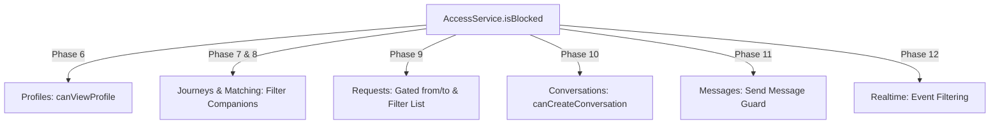

# TrainMate v2 — Milestone 6: Moderation Design Document

**Status:** Approved for Implementation  
**Date:** 2026-08-24  
**Module:** Moderation & Access Control Core (`blocked_users`, `user_reports`, `isBlocked()`)  
**Governing Documents:**
- `docs/Backend-Specification.md` (§3.2, §3.3, §6.7, §6.8, §6.12, §9.7, §9.8, §10.10, §11.8)
- `docs/Backend-Architecture.md` (§2.1, §3.1, §3.2, §6.2)
- `docs/Implementation-Roadmap.md` (Part I map §6.7/§6.8, Part II Phase 5)
- `docs/Design-Review-Report.md` (F3-rls, F5-rls, item 22, item 33)
- Historical Supabase Migrations (`20251215070131`, `20260106151017`, `20260703100726`, `20260716175301`)

---

## Executive Summary

Milestone 6 (Moderation) establishes the cross-cutting safety and visibility foundation for TrainMate v2. It ports `blocked_users` and `user_reports` from historical Supabase to the self-hosted Express/Prisma architecture, introduces the canonical symmetric `isBlocked(userA, userB)` access service, and provides authenticated HTTP endpoints for user blocking, unblocking, block listing, and user reporting.

This milestone is intentionally positioned before Profiles (Phase 6), Journeys (Phase 7), Matching (Phase 8), Requests (Phase 9), Conversations (Phase 10), and Messages (Phase 11) because `isBlocked` is a primary authorization gate across all contextual queries in the system.

---

## 1. Current-State Analysis (Supabase Architecture)

### 1.1 Historical Database Objects
In Supabase, moderation was introduced in migration `20251215070131_3ca540b1-5ea5-43cd-bdb1-b8cb7adb1daa.sql`:

1. **`public.blocked_users` table:**
   ```sql
   CREATE TABLE public.blocked_users (
     id uuid PRIMARY KEY DEFAULT gen_random_uuid(),
     blocker_id uuid NOT NULL,
     blocked_id uuid NOT NULL,
     created_at timestamp with time zone DEFAULT now() NOT NULL,
     UNIQUE(blocker_id, blocked_id)
   );
   CREATE INDEX IF NOT EXISTS idx_blocked_users_lookup ON blocked_users(blocker_id, blocked_id);
   ```
2. **`public.user_reports` table:**
   ```sql
   CREATE TABLE public.user_reports (
     id uuid PRIMARY KEY DEFAULT gen_random_uuid(),
     reporter_id uuid NOT NULL,
     reported_id uuid NOT NULL,
     reason text,
     created_at timestamp with time zone DEFAULT now() NOT NULL
   );
   ```
3. **`public.is_blocked(user_a, user_b)` function (SECURITY DEFINER):**
   ```sql
   CREATE OR REPLACE FUNCTION public.is_blocked(user_a uuid, user_b uuid)
   RETURNS boolean
   LANGUAGE sql STABLE SECURITY DEFINER SET search_path = public AS $$
     SELECT EXISTS (
       SELECT 1 FROM public.blocked_users
       WHERE (blocker_id = user_a AND blocked_id = user_b)
          OR (blocker_id = user_b AND blocked_id = user_a)
     )
   $$;
   ```

### 1.2 Historical RLS Policies
- `blocked_users`:
  - `SELECT`: `auth.uid() = blocker_id` (users only see who they blocked, never who blocked them)
  - `INSERT`: `auth.uid() = blocker_id`
  - `DELETE`: `auth.uid() = blocker_id`
- `user_reports`:
  - `INSERT`: `auth.uid() = reporter_id`
  - `SELECT`: `auth.uid() = reporter_id` (admin listing was out of scope in frontend)

### 1.3 Discovered Database Gaps & Legacy Quirks
As documented in `Design-Review-Report.md` (Finding F3-rls) and `Backend-Specification.md` (§6.7):
1. **Missing Foreign Keys in Original Migration:** The original SQL migration omitted foreign key constraints on `blocked_users(blocker_id, blocked_id)` and `user_reports(reporter_id, reported_id)` to `auth.users(id)`.
2. **Missing Self-Block DB Constraint:** There is no SQL `CHECK (blocker_id <> blocked_id)`.
3. **Free-Text Reports:** `user_reports.reason` has no length cap or enum constraint; frontend sends `reason.trim() || null` (`ReportDialog.tsx`).
4. **Target Express Policy:** In our target architecture (Decision D1), database integrity is reinforced via Prisma relations to `User` (`onDelete: Cascade`), while business constraints (`blocker !== blocked`, target existence, authorization) are strictly enforced in the service layer.

---

## 2. Target Database Design

### 2.1 Prisma Schema Specification
The target Prisma models are defined in `backend/prisma/schema.prisma` alongside the existing `User`, `RefreshToken`, and `EmailVerification` models:

```prisma
/// Mutual and directional block records (Spec §3.2, §6.7; Roadmap Phase 5).
/// Enforces uniqueness on (blocker_id, blocked_id).
/// Foreign keys link to users table with ON DELETE CASCADE.
model BlockedUser {
  id        String   @id @default(uuid()) @db.Uuid
  blockerId String   @map("blocker_id") @db.Uuid
  blockedId String   @map("blocked_id") @db.Uuid
  createdAt DateTime @default(now()) @map("created_at") @db.Timestamptz(3)

  blocker   User     @relation("BlocksInitiated", fields: [blockerId], references: [id], onDelete: Cascade)
  blocked   User     @relation("BlocksReceived", fields: [blockedId], references: [id], onDelete: Cascade)

  @@unique([blockerId, blockedId])
  @@index([blockerId, blockedId])
  @@index([blockedId, blockerId])
  @@map("blocked_users")
}

/// User reports for safety and moderation (Spec §3.2, §6.8; Roadmap Phase 5).
/// reason is free text (no category enum, nullable).
/// Foreign keys link to users table with ON DELETE CASCADE.
model UserReport {
  id         String   @id @default(uuid()) @db.Uuid
  reporterId String   @map("reporter_id") @db.Uuid
  reportedId String   @map("reported_id") @db.Uuid
  reason     String?
  createdAt  DateTime @default(now()) @map("created_at") @db.Timestamptz(3)

  reporter   User     @relation("ReportsFiled", fields: [reporterId], references: [id], onDelete: Cascade)
  reported   User     @relation("ReportsReceived", fields: [reportedId], references: [id], onDelete: Cascade)

  @@index([reporterId])
  @@index([reportedId])
  @@map("user_reports")
}
```

And update `User` model relations:
```prisma
model User {
  // ... existing fields ...
  blocksInitiated BlockedUser[] @relation("BlocksInitiated")
  blocksReceived  BlockedUser[] @relation("BlocksReceived")
  reportsFiled    UserReport[]  @relation("ReportsFiled")
  reportsReceived UserReport[]  @relation("ReportsReceived")
}
```

### 2.2 Column Mapping & Types
| Model | Field | DB Column | Postgres Type | Nullable | Constraints / Defaults |
|---|---|---|---|---|---|
| `BlockedUser` | `id` | `id` | `uuid` | No | PK, `gen_random_uuid()` |
| `BlockedUser` | `blockerId` | `blocker_id` | `uuid` | No | FK → `users.id` CASCADE |
| `BlockedUser` | `blockedId` | `blocked_id` | `uuid` | No | FK → `users.id` CASCADE |
| `BlockedUser` | `createdAt` | `created_at` | `timestamptz(3)` | No | `now()` |
| `UserReport` | `id` | `id` | `uuid` | No | PK, `gen_random_uuid()` |
| `UserReport` | `reporterId` | `reporter_id` | `uuid` | No | FK → `users.id` CASCADE |
| `UserReport` | `reportedId` | `reported_id` | `uuid` | No | FK → `users.id` CASCADE |
| `UserReport` | `reason` | `reason` | `text` | Yes | Free text |
| `UserReport` | `createdAt` | `created_at` | `timestamptz(3)` | No | `now()` |

### 2.3 Indexes & Performance Optimization
1. `@@unique([blockerId, blockedId])` — guarantees no duplicate block rows in the same direction.
2. `@@index([blockerId, blockedId])` — accelerates directional block checks and blocker queries (`GET /blocked-users`).
3. `@@index([blockedId, blockerId])` — accelerates the reverse arm of symmetric `isBlocked(a, b)` checks.
4. `@@index([reporterId])` / `@@index([reportedId])` on `user_reports` — supports audit queries and cascaded user lookups.

---

## 3. Blocking Semantics & `isBlocked()`

### 3.1 Exact Definition of `isBlocked(userA, userB)`
The core safety invariant is that **blocking is strictly symmetric in effect**:

$$\text{isBlocked}(A, B) \iff \text{exists}(\text{blocker}=A, \text{blocked}=B) \lor \text{exists}(\text{blocker}=B, \text{blocked}=A)$$

Rules:
1. **Symmetry:** If user A blocks user B, then `isBlocked(A, B) === true` AND `isBlocked(B, A) === true`.
2. **Reflexivity:** A user cannot block themselves. For any user A, `isBlocked(A, A) === false`.
3. **Null Safety:** If either `userA` or `userB` is null, undefined, empty string, or invalid UUID format, `isBlocked` returns `false`.
4. **Canonical Home:** Implemented in `src/services/access.service.ts` and consumed across all services.

### 3.2 Block Creation (`POST /blocked-users`)
- **Caller Identity:** `blocker_id` is forced from `req.user.id` (authenticated JWT claim). It is NEVER taken from request body.
- **Payload:** `{ blocked_id: string }` (UUID).
- **Validation:**
  - `blocked_id` must be a valid UUID.
  - **Self-block prevention:** `req.user.id === blocked_id` returns `400 VALIDATION_ERROR` (`Cannot block yourself`).
  - **Target existence:** Target user `blocked_id` must exist in `users` table; if not found, returns `404 USER_NOT_FOUND` (`User not found`).
- **Idempotency:**
  - If user A blocks user B when A already blocked B, the operation is **idempotent**: it returns `200 OK` (or `201 Created`) with the existing/persisted record. No unhandled Prisma P2002 error is surfaced.

### 3.3 Unblock (`DELETE /blocked-users/:blockedId`)
- **Caller Identity:** `blocker_id` is forced from `req.user.id`.
- **Target:** `:blockedId` from URL parameters.
- **Directional Scope:** Only deletes the row where `blocker_id = req.user.id AND blocked_id = :blockedId`. If B had also blocked A, B's block record remains intact (though `isBlocked` remains true until B also unblocks A).
- **Idempotency:** Deleting a non-existent block returns `204 No Content` (idempotent success).

### 3.4 Block Listing (`GET /blocked-users`)
- **Caller Identity:** `req.user.id`.
- **Response:** Returns only the IDs of users blocked by the caller:
  ```json
  [
    { "blocked_id": "00000000-0000-4000-8000-000000000002" }
  ]
  ```
  *(Matches the exact format expected by `useBlockedUsers.ts` hook: `.select('blocked_id').eq('blocker_id', me)`).*

---

## 4. Reporting Semantics (`POST /reports`)

### 4.1 Reporting Rules
- **Caller Identity:** `reporter_id` is forced from `req.user.id`.
- **Payload:** `{ reported_id: string, reason?: string | null }`.
- **Validation:**
  - `reported_id` must be a valid UUID.
  - **Self-report prevention:** `req.user.id === reported_id` returns `400 VALIDATION_ERROR` (`Cannot report yourself`).
  - **Target existence:** Target user `reported_id` must exist in `users` table; if not found, returns `404 USER_NOT_FOUND`.
  - **Reason field:** Trimmed string or `null`. Free text without strict length or enum restrictions (bounded by global JSON body limit of 1MB, with reasonable schema max of 2000 chars).
- **Duplicate Reports:** Allowed. A user may report another user multiple times for separate incidents (creates a new row with timestamp).
- **Response:** `201 Created` with the created report object:
  ```json
  {
    "id": "uuid",
    "reporter_id": "uuid",
    "reported_id": "uuid",
    "reason": "Harassment on train 12301",
    "created_at": "2026-08-24T12:00:00.000Z"
  }
  ```

---

## 5. Repository Layer Design

Repositories are thin, strongly typed data access classes directly wrapping Prisma with zero business logic.

### 5.1 `BlockedUserRepository` (`src/repositories/blocked-users.repo.ts`)
```typescript
export interface CreateBlockData {
  blockerId: string;
  blockedId: string;
}

export class BlockedUserRepository {
  constructor(private readonly db: PrismaClient | Prisma.TransactionClient = prisma) {}

  /** Finds specific directional block */
  findByPair(blockerId: string, blockedId: string): Promise<BlockedUser | null>;

  /** Checks if a mutual/symmetric block exists between userA and userB */
  isBlocked(userA: string, userB: string): Promise<boolean>;

  /** Retrieves all user IDs blocked by blockerId */
  findBlockedIdsByBlocker(blockerId: string): Promise<string[]>;

  /** Retrieves full symmetric blocked set for a user (blocked by user OR blocking user) */
  findSymmetricBlockedIds(userId: string): Promise<string[]>;

  /** Inserts a block record (handles duplicate gracefully via find-or-create) */
  create(data: CreateBlockData): Promise<BlockedUser>;

  /** Deletes a block record. Returns true if deleted, false if did not exist */
  deleteByPair(blockerId: string, blockedId: string): Promise<boolean>;
}
```

### 5.2 `UserReportRepository` (`src/repositories/user-reports.repo.ts`)
```typescript
export interface CreateReportData {
  reporterId: string;
  reportedId: string;
  reason?: string | null;
}

export class UserReportRepository {
  constructor(private readonly db: PrismaClient | Prisma.TransactionClient = prisma) {}

  /** Inserts a report record */
  create(data: CreateReportData): Promise<UserReport>;

  /** Finds report by ID */
  findById(id: string): Promise<UserReport | null>;

  /** Lists reports filed by a specific reporter */
  findByReporterId(reporterId: string): Promise<UserReport[]>;
}
```

---

## 6. Service Layer Design

The business logic is partitioned into two specialized services:
1. `AccessService` — The system-wide authorization & visibility query engine (`isBlocked`, `canViewProfile`, `isConversationParticipant`).
2. `ModerationService` — The business workflow service handling block/unblock and report mutations and validations.

### 6.1 `AccessService` (`src/services/access.service.ts`)
```typescript
export interface AccessServiceDeps {
  blockedUsers?: BlockedUserRepository;
}

export class AccessService {
  private readonly blockedUsers: BlockedUserRepository;

  constructor(deps: AccessServiceDeps = {}) {
    this.blockedUsers = deps.blockedUsers ?? new BlockedUserRepository();
  }

  /**
   * Universal symmetric block check.
   * Returns true if userA blocked userB OR userB blocked userA.
   * Returns false if userA === userB or either ID is invalid.
   */
  async isBlocked(userA: string, userB: string): Promise<boolean>;

  /**
   * Returns a Set of all user IDs that have a blocking relationship
   * (in either direction) with the given user. Useful for batch list filtering.
   */
  async getSymmetricBlockedUserIds(userId: string): Promise<Set<string>>;

  /**
   * Scaffolding for future milestones:
   * canViewProfile(requesterId, targetProfileId): Promise<boolean>
   * isConversationParticipant(conversationId, userId): Promise<boolean>
   */
}
```

### 6.2 `ModerationService` (`src/services/moderation.service.ts`)
```typescript
export interface ModerationServiceDeps {
  blockedUsers?: BlockedUserRepository;
  userReports?: UserReportRepository;
  users?: UserRepository;
  access?: AccessService;
}

export class ModerationService {
  private readonly blockedUsers: BlockedUserRepository;
  private readonly userReports: UserReportRepository;
  private readonly users: UserRepository;
  private readonly access: AccessService;

  constructor(deps: ModerationServiceDeps = {}) {
    this.blockedUsers = deps.blockedUsers ?? new BlockedUserRepository();
    this.userReports = deps.userReports ?? new UserReportRepository();
    this.users = deps.users ?? new UserRepository();
    this.access = deps.access ?? new AccessService({ blockedUsers: this.blockedUsers });
  }

  /**
   * Blocks a user.
   * Validates target user exists and blockerId !== blockedId.
   * Idempotent on duplicate.
   */
  async blockUser(blockerId: string, blockedId: string): Promise<BlockedUser>;

  /**
   * Unblocks a user.
   * Idempotent (succeeds even if block did not exist).
   */
  async unblockUser(blockerId: string, blockedId: string): Promise<void>;

  /**
   * Returns list of blocked IDs for the caller: { blocked_id: string }[]
   */
  async getBlockedUsers(blockerId: string): Promise<{ blocked_id: string }[]>;

  /**
   * Submits a user report.
   * Validates target user exists and reporterId !== reportedId.
   */
  async reportUser(reporterId: string, reportedId: string, reason?: string | null): Promise<UserReport>;
}
```

---

## 7. Cross-Cutting Authorization Integration

The `isBlocked()` service function is the single source of truth for visibility gating in future phases:



### Detailed Matrix of Downstream Invariants:
1. **Profiles (Phase 6):** `canViewProfile(viewer, targetId)` must short-circuit to `false` if `isBlocked(viewer, targetId)` is `true`. `GET /profiles/:id` returns `404 NOT_FOUND` (non-leaking).
2. **Journeys & Matching (Phase 7 & 8):** `GET /journeys/:train/:date/companions` filters out companions where `isBlocked(viewer, companion.userId)` is `true`.
3. **Requests (Phase 9):**
   - `POST /requests` rejects request creation if `isBlocked(sender, receiver)` is `true` (`403 FORBIDDEN`).
   - `GET /requests` query filters out any requests where either sender or recipient is in the caller's symmetric block set.
4. **Conversations (Phase 10):**
   - `canCreateConversation(participants)` requires `!isBlocked(p1, p2)`.
   - **Conversation Retention Invariant:** Existing conversations remain visible in the list (`Chats.tsx` displays blocked badge); soft-delete remains independent.
5. **Messages (Phase 11):**
   - `POST /conversations/:id/messages` checks `!isBlockedInConversation(convId, senderId)`; blocks message insertion with `403 FORBIDDEN` if participants have blocked each other.
6. **Realtime & WebSockets (Phase 12):**
   - Socket.IO server does not dispatch presence or typing events across blocked pairs.

---

## 8. HTTP & API Boundary

### 8.1 Route Mapping
Mounted on `/blocked-users` and `/reports` (or under `/moderation` with direct route aliases):

| Method | Path | Middleware | Request Body / Params | Status | Response Body |
|---|---|---|---|---|---|
| `GET` | `/blocked-users` | `authenticate` | None | `200 OK` | `[{ "blocked_id": "uuid" }]` |
| `POST` | `/blocked-users` | `authenticate`, `validateBody(blockUserSchema)` | `{ "blocked_id": "uuid" }` | `201 Created` (or `200`) | `{ "id": "uuid", "blocker_id": "uuid", "blocked_id": "uuid", "created_at": "..." }` |
| `DELETE` | `/blocked-users/:blockedId` | `authenticate`, `validateParams(unblockParamSchema)` | `:blockedId` in URL | `204 No Content` | None |
| `POST` | `/reports` | `authenticate`, `validateBody(reportUserSchema)` | `{ "reported_id": "uuid", "reason"?: string }` | `201 Created` | `{ "id": "uuid", "reporter_id": "uuid", "reported_id": "uuid", "reason": "...", "created_at": "..." }` |

### 8.2 Zod Validation Schemas (`src/validation/moderation.schemas.ts`)
```typescript
import { z } from 'zod';

export const blockUserSchema = z.object({
  blocked_id: z.string().uuid({ message: 'Invalid blocked_id UUID' }),
});

export const unblockParamSchema = z.object({
  blockedId: z.string().uuid({ message: 'Invalid blockedId UUID' }),
});

export const reportUserSchema = z.object({
  reported_id: z.string().uuid({ message: 'Invalid reported_id UUID' }),
  reason: z.string().max(2000).optional().nullable().transform((r) => (r?.trim() ? r.trim() : null)),
});
```

### 8.3 Error Codes & Envelopes
All error responses adhere to the standard envelope `{ error: { code, message, details? } }`:
- `400 VALIDATION_ERROR` — Malformed UUID, self-block attempt (`Cannot block yourself`), or self-report attempt (`Cannot report yourself`).
- `401 AUTH_REQUIRED` / `AUTH_INVALID_TOKEN` — Missing or invalid Bearer access token.
- `404 USER_NOT_FOUND` — Attempting to block or report a user UUID that does not exist in `users`.

---

## 9. Security & Threat Analysis

| Threat ID | Threat Vector | Risk | Mitigation Control |
|---|---|---|---|
| **T-MOD-1** | **Caller Impersonation:** Attacker sends `{ blocker_id: victimId }` in request body. | Unauthorized blocking on behalf of victims. | **Enforced in Middleware:** `blocker_id` and `reporter_id` are strictly extracted from verified `req.user.id` JWT claims. Any body property is ignored/stripped by Zod schema. |
| **T-MOD-2** | **Self-Block / Self-Report Logic Flaws:** User blocks themselves to cause self-lockout or query corruption. | System inconsistency in companion/journey queries. | Route & service layer reject `blocker_id === blocked_id` with `400 VALIDATION_ERROR`. |
| **T-MOD-3** | **Blocked Status Existence Leak:** User probes API to discover if a specific person blocked them. | User privacy breach. | `isBlocked` is never surfaced directly as a binary probe endpoint for arbitrary pairs. Resource reads (e.g. `GET /profiles/:id`) return identical `404 NOT_FOUND` whether blocked or non-existent. |
| **T-MOD-4** | **Phantom Target Abuse:** User spams block/report on non-existent UUIDs. | DB pollution / foreign key failure. | Service layer verifies target user existence via `users.findById()` before creating block/report records, returning `404 USER_NOT_FOUND`. |
| **T-MOD-5** | **Race Conditions on Duplicate Block:** Concurrent duplicate block requests. | Unique constraint crash (500). | Repository uses atomic find-or-create / handles Prisma P2002 to return idempotent success. |
| **T-MOD-6** | **Deleted User Retention:** Account deletion leaves dangling block/report records. | Referential integrity breakdown. | Prisma schema defines `onDelete: Cascade` on all `User` relations in `BlockedUser` and `UserReport`. |

---

## 10. Testing Strategy

### 10.1 Unit Tests (`backend/test/services/access.service.test.ts`, `backend/test/services/moderation.service.test.ts`)
- **`AccessService.isBlocked` Truth Table:**
  - `A blocks B` $\implies$ `isBlocked(A, B) === true` and `isBlocked(B, A) === true` (Symmetry test).
  - `Neither blocked` $\implies$ `isBlocked(A, B) === false`.
  - `Self-check` $\implies$ `isBlocked(A, A) === false`.
  - `Invalid input` (empty, null, non-UUID) $\implies$ `isBlocked('', B) === false`.
- **`ModerationService` Logic:**
  - `blockUser` throws `400` on self-block.
  - `blockUser` throws `404` when target user does not exist.
  - `blockUser` succeeds and idempotently handles existing block.
  - `unblockUser` deletes block and succeeds idempotently if block did not exist.
  - `reportUser` throws `400` on self-report.
  - `reportUser` throws `404` when target does not exist.
  - `reportUser` trims free-text reason and saves null for empty string.

### 10.2 Repository Unit Tests (`backend/test/repositories/blocked-users.repo.test.ts`, `user-reports.repo.test.ts`)
- Mocks Prisma client to verify exact query parameters, `findUnique`, `findMany`, `create`, `deleteMany` invocations.

### 10.3 Route & Controller Unit Tests (`backend/test/routes/moderation.routes.test.ts`)
- Tests all 4 HTTP endpoints with mocked `ModerationService`.
- Verifies input validation (invalid UUID, missing fields, body structure).
- Verifies `401 AUTH_REQUIRED` when unauthenticated.

### 10.4 Database-Backed Integration Tests (`backend/test/integration/moderation.lifecycle.test.ts`)
- Uses real disposable Postgres container (`testdb`) via `setup.integration.ts`.
- **Flow 1 (Block Lifecycle):** Register User 1 & User 2 $\to$ User 1 blocks User 2 $\to$ Verify DB row $\to$ `isBlocked(U1, U2)` and `isBlocked(U2, U1)` both return true $\to$ `GET /blocked-users` returns `[{ blocked_id: U2 }]` $\to$ User 2 calls `GET /blocked-users` and receives `[]` (cannot see who blocked them) $\to$ User 1 unblocks User 2 $\to$ `isBlocked` returns false.
- **Flow 2 (Self-Block Prevention):** Attempt self-block via HTTP $\to$ Assert 400.
- **Flow 3 (Reporting Flow):** Register User 1 & User 2 $\to$ User 1 reports User 2 $\to$ Verify DB row created with reason $\to$ Submit second report $\to$ Both persisted.
- **Flow 4 (Cascade Deletion):** Block & report created $\to$ User 2 deleted $\to$ Blocks and reports for User 2 automatically cascaded.

---

## 11. Migration Strategy

### 11.1 Schema Migration (`npx prisma migrate dev --name add_moderation_tables`)
1. Add `BlockedUser` and `UserReport` models to `prisma/schema.prisma`.
2. Generate migration SQL creating `blocked_users` and `user_reports` tables, indexes, and foreign keys.
3. Run `prisma generate` to update the TypeScript Prisma client.

### 11.2 Historical Data Migration (`scripts/import.mjs`)
- `blocked_users` rows from Supabase `pg_dump` are imported directly, preserving:
  - `id` (UUID PK)
  - `blocker_id` (matches migrated `users.id`)
  - `blocked_id` (matches migrated `users.id`)
  - `created_at` timestamp
- `user_reports` rows from Supabase are imported directly, preserving:
  - `id` (UUID PK)
  - `reporter_id`
  - `reported_id`
  - `reason`
  - `created_at` timestamp

---

## 12. Rollback Strategy

1. **Isolation:** Moderation endpoints are behind the future frontend adapter (Phase 13). No live production traffic touches the new backend during M6.
2. **Schema Rollback:** The migration adds two new independent tables (`blocked_users`, `user_reports`). Rollback is a standard migration rollback or table drop without impacting `users`, `refresh_tokens`, or `email_verifications`.
3. **Database Integrity:** Existing Supabase production database is 100% untouched.

---

## 13. Risks & Open Questions Analysis

### 13.1 Evaluated Risks
1. **Symmetric Block Query Drift:** If downstream queries inadvertently check only `blocker_id = me` instead of calling `AccessService.isBlocked()` or `getSymmetricBlockedUserIds()`, one-sided visibility leaks would occur.
   - *Mitigation:* All downstream services MUST consume `AccessService` rather than querying `blocked_users` directly.
2. **Large Blocklist Performance in Matching Queries:** If a user blocks many users, in-memory filtering vs SQL `NOT IN` in companion matching could degrade.
   - *Mitigation:* `idx_blocked_users_lookup` and reverse index `[blocked_id, blocker_id]` ensure fast subquery resolution in SQL.

### 13.2 Open Questions Resolution
- **Q1: Should re-blocking an already blocked user return 200/201 or 409 Conflict?**
  - *Resolution:* Return `200 OK` (idempotent upsert/find-or-create). This aligns with `useBlockedUsers.ts` behavior where client state seamlessly reconciles.
- **Q2: Should unblocking a user who is not currently blocked return 404 or 204?**
  - *Resolution:* Return `204 No Content` (idempotent delete). Standard REST convention for resource deletion.

---

## 14. Milestone 6 Acceptance Criteria

Before declaring Milestone 6 complete, the following checklist must be satisfied:

- [ ] **Prisma Schema:** `BlockedUser` and `UserReport` models added with correct mappings, types, relations, indexes, and constraints.
- [ ] **Database Migration:** Prisma migration compiles and applies cleanly on test and dev databases.
- [ ] **Repositories:** `BlockedUserRepository` and `UserReportRepository` implemented with full unit tests.
- [ ] **Access Service:** `AccessService.isBlocked(a, b)` implemented with 100% unit test coverage of symmetry, self-check, and null safety.
- [ ] **Moderation Service:** `ModerationService` implemented with self-block/report rejection, target user existence validation, and idempotency.
- [ ] **HTTP Layer:** `GET /blocked-users`, `POST /blocked-users`, `DELETE /blocked-users/:blockedId`, and `POST /reports` mounted on Express with `authenticate` middleware and Zod request validation.
- [ ] **Integration Suite:** Database-backed integration tests in `backend/test/integration/moderation.lifecycle.test.ts` passing against real PostgreSQL.
- [ ] **All Quality Gates Green:** Unit tests passing, typecheck passing, ESLint passing, Prettier format check passing, `tsc` build passing.
- [ ] **Zero Implementation Regressions:** M1–M5 tests and existing 219+ unit tests remain 100% passing.
- [ ] **No Future Milestone Code Leaked:** Profiles (M7), Journeys, Matching, Requests, etc. are NOT implemented in M6.
